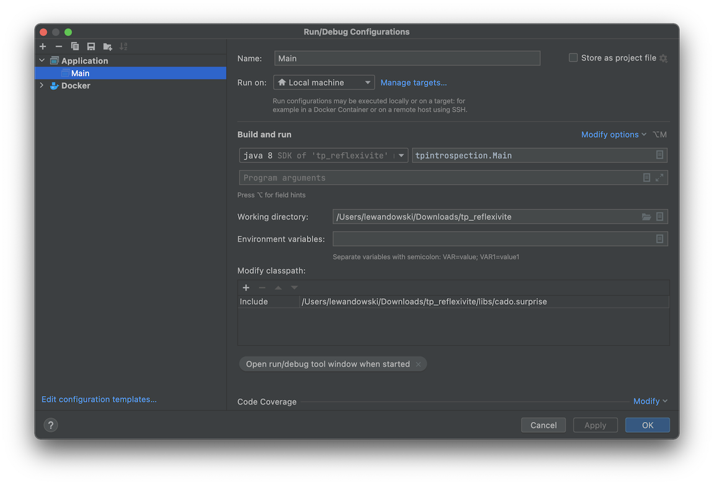

# POOA – TP Introspection et réflexivité
_(inspiré d'un énoncé de Yvan Royon)_

## 🎯 But du TP 
Il s'agit d'explorer les mécanismes d'introspection offerts par Java.
Pour cela, nous allons manipuler les classes `Class`, `Object`, 
ainsi que les éléments du package `java.lang.reflect`.

## 🎁 Introduction 

De retour d'un voyage dans un pays lointain, votre papi préféré vous ramène un très beau spécimen : 
une instance de `java.util.Vector` originale, peuplée d'un certain nombre d'éléments. Merci papi !

C'est très gentil de sa part, seulement il est un peu tête-en-l'air : il a oublié de vous dire ce qu'il y avait dans le Vector. 
Pire, il a perdu le code source et la javadoc du programme qui l'a généré. 
Et bien sûr, vous n'avez même pas le ticket de caisse pour vous faire rembourser.

Qu'allez-vous donc faire de ce Vector ? Vous pouvez récupérer le contenu sous forme d'objets (`java.lang.Object`), 
mais vous ne savez pas quoi en faire. Vous ne savez pas vers quelle classe effectuer le transtypage (« cast » en VO), comme vous faites d'habitude :

>  `String s = (String) monVector.get(1);`

Mais rassurez-vous, tout n'est pas perdu (ouf). En effet, Java vous fournit des mécanismes d'introspection et de réflexivité, 
respectivement pour découvrir la structure interne d'une classe ou d'un objet et pour agir dessus.

Vous allez dans ce TP découvrir la classe `java.lang.Class`, la classe `java.lang.Object` et le package `java.lang.reflect`. 
Il s'agit d'outils très puissants et « bas niveau » dans Java, qui rendent possibles des technologies comme RMI ou JavaBeans (cf. sérialisation). 
Vous les utiliserez pour tout découvrir sur le contenu du Vector offert par papi.

## 🎛 Préparation

Dans le dossier `src/`, vous trouverez la classe principale dans laquelle vous allez travailler : la classe `Main`. 
À l'intérieur, le code qui permet de récupérer le vecteur contenant les cadeaux est déjà écrit. 
Quant à la classe `PapiBarbu`, rien d'intéressant pour vous là-dedans.

Dans le dossier `libs/`, vous trouverez le fichier `cado.surprise` nécessaire à l'exécution du projet, 
un fichier mystérieux contenant les cadeaux et généré grâce à un simulateur de papi top secret. 
Pour démarrer, il faut vérifier que ce fichier est bien présent dans le classpath, à l'éxécution. 

Editez la configuration de Run, et vérifiez que le fichier `cado.surprise` apparaît bien dans la liste. 
Si ce n'est pas le cas, ajoutez-le (`Modify options` > `Modify classpath`)

> **👊 POUR LA SUITE**
> 
> - Gardez la javadoc sous les yeux : [https://docs.oracle.com/...](https://docs.oracle.com/en/java/javase/11/docs/api/java.base/java/lang/Class.html)
> - Modifiez la classe `Main` et testez/vérifiez vous-mêmes les réponses
> - Dialoguez avec l'enseignant : le but est de comprendre !
> - Ayez l'âme d'explorateur qui anime papi : soyez curieux ... 

## Classe `Object`

En Java, toutes les classes héritent de la classe `Object`. Ceci permet d'une part d'adresser tous les objets de manière générique, par exemple pour les placer dans un Vector, et d'autre part de forcer des comportements génériques à tous les objets. C'est le cas par exemple de la méthode `toString()` :

**Question 1 :** À quoi sert la méthode `toString()` de la classe `Object` ? Qu'est-elle censée nous renvoyer ?
-> La methode toString() sert à fournir une représentation sous forme de chaîne de caractere et la @hchcode de la classe et elle renvoie une chaîne qui contient le nom complet de la classe objet.

**Question 2 :** Qu'est-ce que cette méthode vous permet de déduire sur chacun des éléments qui sont dans le vecteur ?
-> cette méthode permet de déduire une description textuelle de chaque élément contenu dans le vecteur

**Question 3 :** Qu'en concluez-vous ?
-> On peut conclure que la méthode toString() joue un rôle essentiel pour l'affichage et le débogage des objets dans une collection comme un vecteur

## Classe `Class` et package `java.lang.reflect`

La classe `java.lang.Class` fournit une représentation des classes. Nous verrons quelle est cette représentation plus loin. `Class` étant une classe, on peut l'instancier... 

**Question 4 :** Mais alors, les classes sont-elles des objets ?
Non, les classes ne sont pas des objets en java.

> Indice : ǝᴉɓoๅouᴉɯɹǝʇ. Ne pas confondre la notion de classe et sa représentation interne dans la machine virtuelle. 
Cette représentation interne des classes permet de les introspecter (découvrir leur composition interne).

**Question 5 :** À quoi peut-on accéder ?

Repérez comment accéder à la liste des méthodes d'une classe, de ses constructeurs, de ses attributs. Les types retournés par ces méthodes appartiennent au package `java.lang.reflect`.
-> On peut accéder à tous les membres d’une classe (méthodes, constructeurs, champs) via la réflexion

**Question 6 :** Quels sont les méthodes, constructeurs, attributs des éléments contenus dans le vecteur ? (Codez !)
-> voir code et résultat 

> À titre d'exemple, choisissez un des éléments du vecteur. Découvrez dynamiquement sa liste de méthodes, et appelez une de ces méthodes. Rappel : lorsque vous codez, vous ne connaissez pas à l'avance le nom de la méthode à invoquer !
> 
> Comparez et testez les méthodes `getFields()` et `getDeclaredFields()`. Que retournent-elles ?
- getDeclaredFields() → Tous les champs déclarés DANS la classe 
- getFields() → Seulement les champs PUBLICS, y compris ceux HÉRITÉS

**Question 7 :** Que pouvez-vous dire au sujet de l'encapsulation (Pensez aux mots-clés `private`, `public`) ? Y a-t-il des incidences du point de vue sécurité ? Discutez !
- L'encapsulation vise à protéger l'état interne des objets en cachant leurs attributs et permettent pas l'accès que sur des methodes controlées.
- Neamoins la methode n'est pas securitiaitre car grâce à la reflexion, on peux contourner l'encapsulation en accedant a des champs et methodes privates via etAcessible(true)

**Question 8 :** D'après vous, à quoi ces méthodes peuvent servir dans la vraie vie ? Quelles sortes d'applications pourraient avoir besoin de ce genre de méthodes ?
-> Ces méthodes permettent d'analyser et d'interagir avec des objets sans les connaître à l'avance.

**Question 9 :** Pourquoi la classe `Class` est-elle `final` ?
-> Car elle ne peut pas être heritée par une autre classe.

## Réfléxivité

Nous avons vu qu'il est possible de récupérer énormément d'informations sur les classes et les objets, y compris ceux que le développeur ne connaît pas à priori. Nous allons maintenant voir qu'il est possible d'agir dessus.

Observez la classe `java.lang.reflect.Field`. Les méthodes `getXX` permettent de lire les valeurs des champs, les méthodes `setXX` de les modifier.

**Question 10 :** Modifiez un attribut public quelconque d'un des éléments contenus dans le vecteur.

> Jusqu'ici, cela correspond à une utilisation normale : `monObjetDeClasseX.unAttributPublic = valeur;`
> 
> La différence est que la classe et le nom de l'attribut sont découverts dynamiquement, sans connaissance préalable.

Etape suivante : par héritage, la classe `Field` dispose d'une méthode `setAccessible()`.

**Question 11 :** Que fait cette méthode ?
-> Cette methode permet de countourner les regles de l'encapsulation et acceder à des champs, methode, attribut et constructeur privé ou public

**Question 12 :** Utilisez-la en reprenant vos conclusions aux questions 6, 7 et 10.

## 🚨 Conclusion

Si vous avez bien suivi, vous venez de modifier la valeur d'un champ private appartenant à une instance d'une classe que vous ne connaissez même pas et qui se trouvait dans un fichier mystérieux. 🤨

Cela signifie que, lorsque vous utilisez Java dans un environnement critique (serveur d'entreprise...), il faut prendre des précautions supplémentaires. C'est également vrai pour .NET, et pour n'importe quelle technologie capable d'introspection et de réflexivité. En Java, on peut se protéger de modifications extérieures en utilisant un « Security Manager ».

**Question 13 :** Faites quelques recherches et implémentez un « Security Manager » basique qui empêche ces modifications.